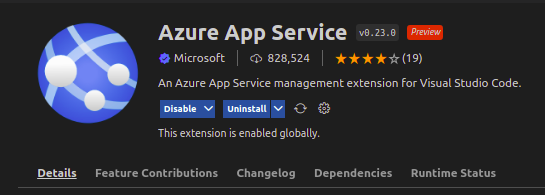

# Deploy App ASP.NET no Azure com Visual Code on Ubuntu

## Requisitos:

- Visual Studio Code instalado na maquina
- Conta Microsoft 
- Assinatura Portal Azure

Criar uma pasta do projeto comando abaixo:  
```bash
mkdir ProjectFolderName
```
Navegar até a pasta do projeto e executar o comando abaixo:
```bash
dotnet new webapp
```
Saída do comando acima será algo semelhante ao citado abaixo: 
```bash
Building...
info: Microsoft.Hosting.Lifetime[14]
      Now listening on: https://localhost:7238
info: Microsoft.Hosting.Lifetime[14]
      Now listening on: http://localhost:5259
info: Microsoft.Hosting.Lifetime[0]
      Application started. Press Ctrl+C to shut down.
info: Microsoft.Hosting.Lifetime[0]
      Hosting environment: Development
info: Microsoft.Hosting.Lifetime[0]
      Content root path: /home/USER/ProjectFolderName
```

Passo a passo para publicar aplicação.
- Dentro do diretório da aplicação executaremos o comando: 
```bash
dotnet publish -c Release -o ./publish
```
ao executar o acima comando será criado uma pasta com o nome "publish" na estrutura do projeto. Caso queira verificar se o mesmo está rodando e o que será publicado dentro da pasta publish executar o comando:
```bash
./nome-da-sua-aplicacao
```

A saída será algo semelhante a isso:
```bash
info: Microsoft.Hosting.Lifetime[14]
      Now listening on: http://localhost:5000
info: Microsoft.Hosting.Lifetime[14]
      Now listening on: https://localhost:5001
info: Microsoft.Hosting.Lifetime[0]
      Application started. Press Ctrl+C to shut down.
info: Microsoft.Hosting.Lifetime[0]
      Hosting environment: Production
info: Microsoft.Hosting.Lifetime[0]
      Content root path: /home/USER/publish
```

## Visual Code
Para abrir a guia de extensões do Visual Studio Code utilizar atalho no teclado:
```bash
Ctrl+Shift+X
```
Localizar a extensão Azure App Service e click em "Install"



Depois será necessário realizar login com sua conta microsoft vinculada a Azure Portal.
- Para abrir paleta de comandos dentro do visual code execute o comando abaixo: 

```bash
Ctrl+Shift+P
```
Localize por ``` Azure: Sign In ``` para efetuar o login. 

Após efetuar login serão exibidas suas assinaturas e sub inscrições clique no ícone de nuvem ```"Deploy to Web App"``` conforme imagem abaixo:


Navegue até a pasta do projeto localize a pasta gerada anteriormente com o nome de ``` "publish" ``` Selecione ``` "Create new App" ```  Insira um nome para o aplicativo Web. A extensão criará o aplicativo Web e começará automaticamente a implantar o pacote nele. Depois que a implantação for concluída, clique em  ``` "Browse Website" ```   para acessar a aplicação rodando em Cloud.


